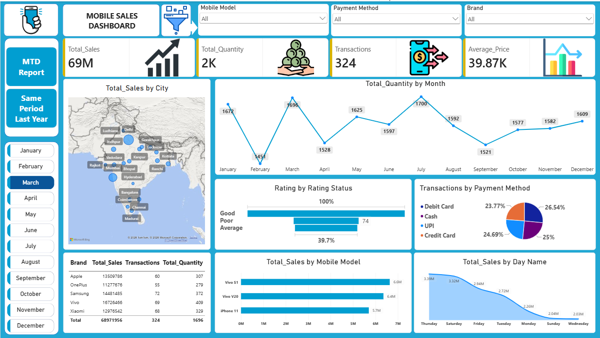
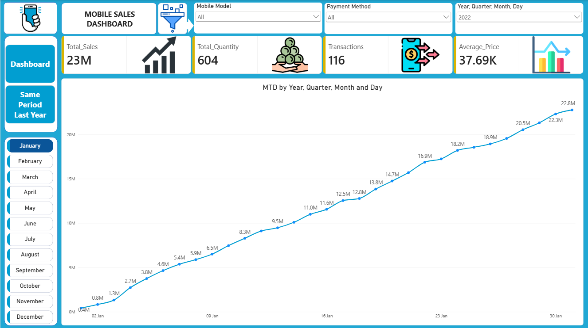
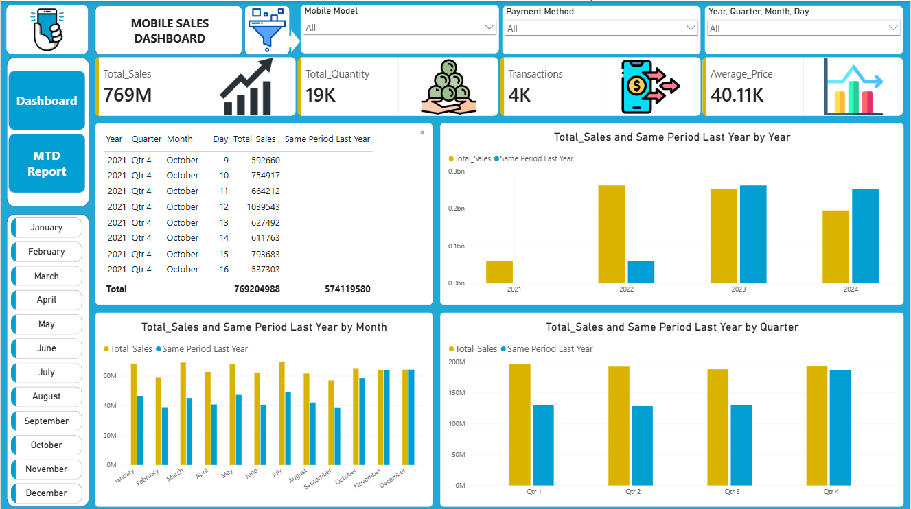

# Mobile Sales Performance Dashboard — Power BI

An interactive Power BI dashboard analysing mobile sales performance, built to 
strengthen skills in data modeling, DAX, and business intelligence reporting.

## Dashboard Preview

## Key Insights
- **Total Sales:** 769M+
- **Total Quantity Sold:** 19K units
- **Total Transactions:** 4K+
- **Average Sales Value:** 40.11K

## Features
- Monthly sales trend analysis
- Top 5 mobile models performance
- City-wise sales distribution map
- Brand-wise quantity analysis
- Customer rating insights
- Payment method analysis
- Day-wise sales & quantity tracking
- Interactive filters for brand, payment method, and month

## What I Built
- Cleaned and transformed raw sales data
- Created a custom calendar table and built data model relationships
- Wrote DAX measures including MTD, QTD, YTD, and same-period-last-year comparisons
- Designed interactive visuals with cross-filtering (edit interactions)

## Tools Used
Power BI Desktop, DAX, Power Query, Power BI Service

## Files
- `Mobile-Sales-Dashboard.pbix` — the Power BI project file
